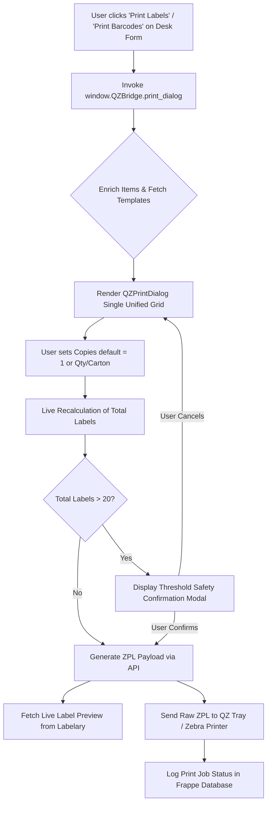
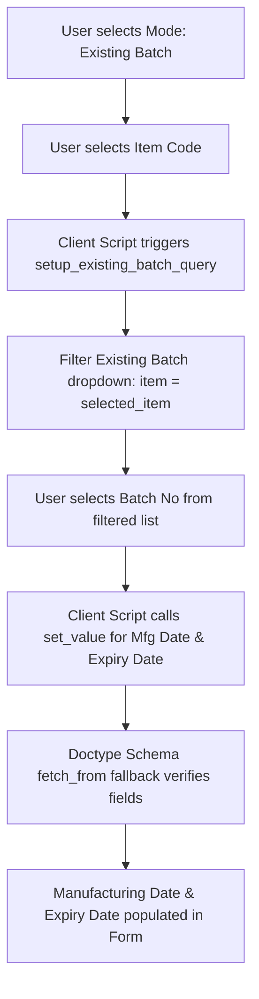

# 🖨️ QZBridge — Frappe Thermal Label Printing & Barcode Management System

**QZBridge** is a high-performance, safety-focused label printing service layer for **Frappe & ERPNext**. It seamlessly connects ERPNext transactions (Purchase Receipts, Stock Entries, Sales Invoices, Items) directly to **QZ Tray** and **Zebra Browser Print** thermal barcode printers.

---

## 🌟 Key Features & Improvements

### 1. 🛡️ Safety-First Print Dialog (`QZPrintDialog`)
- **Single Unified Grid**: Eliminates confusing dual-tab interfaces (Standard vs Carton). All items, batches, UOMs, and print modes are managed in one real-time table.
- **`Copies = 1` Default**: Prevents accidental printing of hundreds of labels by defaulting row copies to `1` regardless of transaction quantity.
- **Per-Row Print Modes**:
  - **`Per Item`**: Specify exact label copies per item row.
  - **`Per Carton`**: Enter `Qty/Carton` to automatically calculate full cartons and remainder partial carton labels with `Carton X of Y` tracking.
- **Live Total Labels Counter**: Real-time summary bar at the bottom displaying total label count (`Total Labels to Print: X`).
- **High-Quantity Safety Threshold**: Triggers a confirmation modal whenever total labels exceed **20 labels**, highlighting total print count and printer target to prevent wasted labels.
- **Labelary ZPL Preview**: Live visual rendering of Zebra ZPL label templates with automated 413 Payload protection (pre-extracts primary `^XA...^XZ` blocks).

### 2. 🏷️ Barcode Generation Tool
- **Item-Filtered Batch Dropdown**: Selecting an `Item Code` automatically restricts the `Existing Batch` dropdown to show **only batches belonging to that specific Item**.
- **Atomic Date Auto-Population**: Selecting a batch instantly populates `Manufacturing Date` and `Expiry Date` across both client script handlers and server-side `fetch_from` directives.

---

## 📊 System Architecture & Flowcharts

### 1. Print Label Execution Flow



---

### 2. Barcode Generation Tool Batch Filter & Date Auto-Fill



---

### 3. Per-Carton Label Calculation Logic

```mermaid
flowchart TD
    A[Transaction Item: Qty = 100 Pcs, Qty/Carton = 30] --> B[Calculate Full Cartons: floor 100 / 30 = 3]
    B --> C[Calculate Remainder: 100 mod 30 = 10]
    C --> D[Generate 3 Full Carton Labels: Qty 30 Pcs | Carton 1 of 4, 2 of 4, 3 of 4]
    D --> E[Generate 1 Partial Carton Label: Qty 10 Pcs | Carton 4 of 4]
    E --> F[Total Labels Generated = 4 Labels]
```

---

## 📁 Directory & Codebase Structure

```
apps/qzbridge/
├── qzbridge/
│   ├── api.py                   # Whitelisted APIs for Jinja context enrichment & ZPL payload generation
│   ├── helpers.py               # Label quantity, packaging math, & ZPL template renderer
│   ├── hooks.py                 # App hooks & asset cache-busting version configuration
│   ├── public/
│   │   ├── js/
│   │   │   ├── print_dialog.js  # Redesigned single-grid QZPrintDialog modal script
│   │   │   ├── qzbridge.js      # Global window.QZBridge API entry points
│   │   │   ├── qz_connect.js   # QZ Tray WebSocket connection management
│   │   │   └── consumer_button.js # Frappe Desk form custom action buttons
│   └── qzbridge/
│       └── doctype/
│           ├── barcode_generation_tool/ # Barcode generation tool controller & schema
│           └── label_template/           # Label format template definition & Jinja ZPL templates
```

---

## 🛠️ API Reference

### `qzbridge.api.get_templates_for_doctype(doctype)`
Returns all active `Label Template` records configured for the specified document type.

### `qzbridge.api.enrich_items_with_batches(items_json)`
Accepts item JSON array from Desk forms and attaches batch data (`manufacturing_date`, `expiry_date`, `batch_qty`) for printing.

### `qzbridge.api.get_print_data(template_name, context_json)`
Renders Jinja2 ZPL template with provided document context and returns raw ZPL strings ready for QZ Tray.

---

## 🚀 Installation & Setup

```bash
cd frappe-bench
bench get-app https://github.com/Somilvaishya/qzbridge.git
bench install-app qzbridge
bench migrate
```

---

## 📜 License
MIT License. Created & maintained by Somil.
